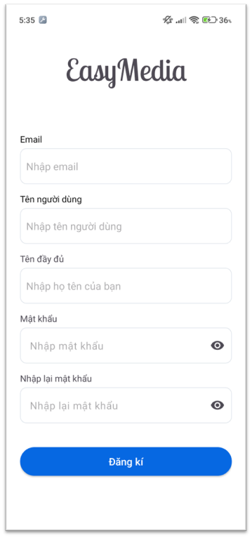
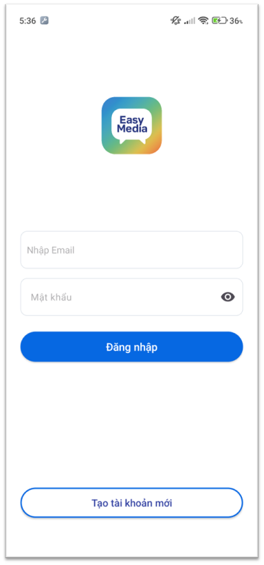
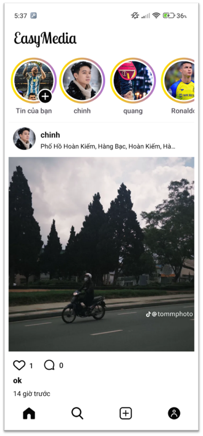
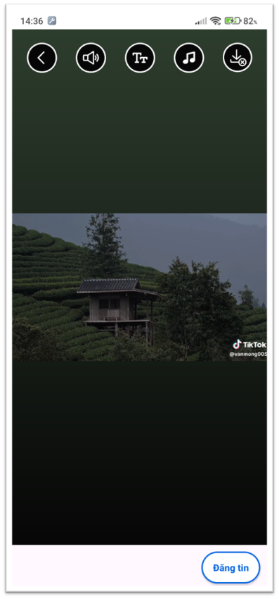
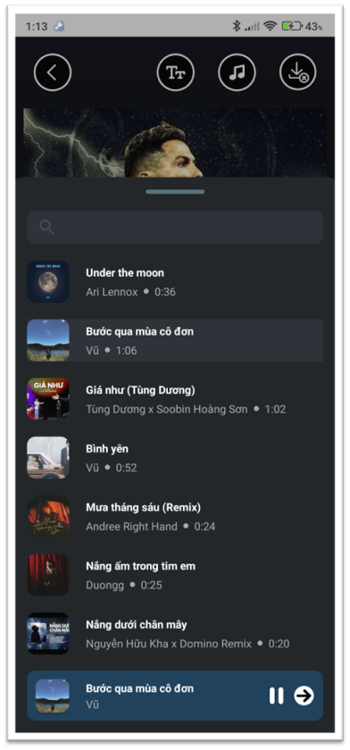
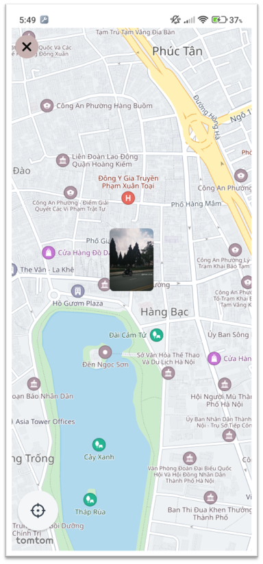
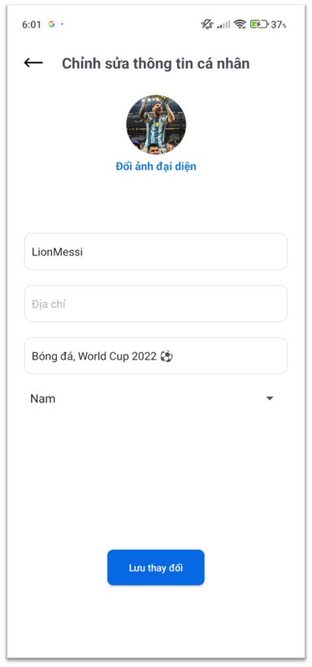

# EasyMedia

## 📖 Description
EasyMedia là ứng dụng mạng xã hội gọn nhẹ dành cho Android, cho phép người dùng
chia sẻ bài viết, story và tương tác với nhau thông qua các tính năng xã hội cơ bản.

## ✨ Features

### 👤 User
- Đăng ký / đăng nhập tài khoản
- Đăng bài viết và story
- Tương tác xã hội: like, bình luận
- Theo dõi / hủy theo dõi người dùng
- Tìm kiếm người dùng
- Gắn vị trí cho bài đăng và hiển thị trên bản đồ

## 🛠 Tech Stack
- Language: Kotlin
- Platform: Android
- Backend: Firebase
    - Firebase Authentication
    - Cloud Firestore
    - Firebase Storage
- Media Storage: Cloudinary

## 📱 Screenshots

Một số hình ảnh giao diện của ứng dụng:

